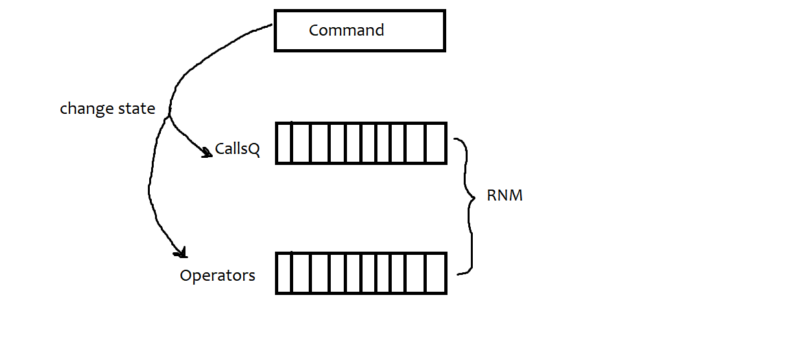

<h1> Simulador de Telefonia <h1>

<h4>Este projeto trate-se de uma simulação de um serviço de telefonia, referen-te ao processo seletivo da Vulcanet. Para mais detalhes do <a href = './Queue Application - Marcelo Salles Previti.pdf'>enunciado</a> do problema proposto.<h4> 
 
<h2> Lógica geral <h2>

<h4>Pode-se definir que o manejamento das ligações possui três grandes entidades: comandos de ações, fila de ligações, e array de operadores. O primeiro representa as ordens provenientes do usuário. O segundo, a fila de espera das ligações. Por fim, o último refere-se ao conjunto total de operadores. A figura a seguir resume o fluxo do programa.<h4>
 

 
<h4>Como demonstrado, cada comando proveniente do usuário possui o papel de alterar o estado das ligações e dos operadores (por exemplo, atender faz com que o operador deixa de estar "tocando" para ocupado). Após este processo, ocorre a chamada RNM (regra de negócio máxima), que consiste em atribuir a ligação que está no topo da fila de ligações para o primeiro funcionário disponível. Esse fluxo atende a todos os casos especificados no problema<h4>
 
<h2>Código</h2>
 
<h3>Padrões Adotados<h3>
 
<h4>A nomeação de variáveis foi feita em língua inglesa usando-se cammel case, com a primeira letra minúscula. Nomes de arquivos seguem o mesmo padrão. Classes são nomeadas com primeira letra maiúscula </h4>
